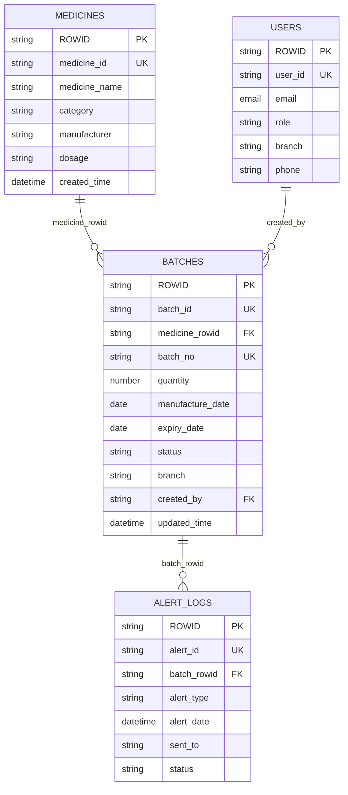

# Entity Relationship Diagram

```mermaid
erDiagram
  MEDICINES ||--o{ BATCHES : "medicine_rowid"
  USERS ||--o{ BATCHES : "created_by"
  BATCHES ||--o{ ALERT_LOGS : "batch_rowid"
  MEDICINES { string ROWID PK string medicine_id UK string medicine_name string category string manufacturer string dosage datetime created_time }
  USERS { string ROWID PK string user_id UK email email string role string branch string phone }
  BATCHES { string ROWID PK string batch_id UK string medicine_rowid FK string batch_no UK number quantity date manufacture_date date expiry_date string status string branch string created_by FK datetime updated_time }
  ALERT_LOGS { string ROWID PK string alert_id UK string batch_rowid FK string alert_type datetime alert_date string sent_to string status }
```
